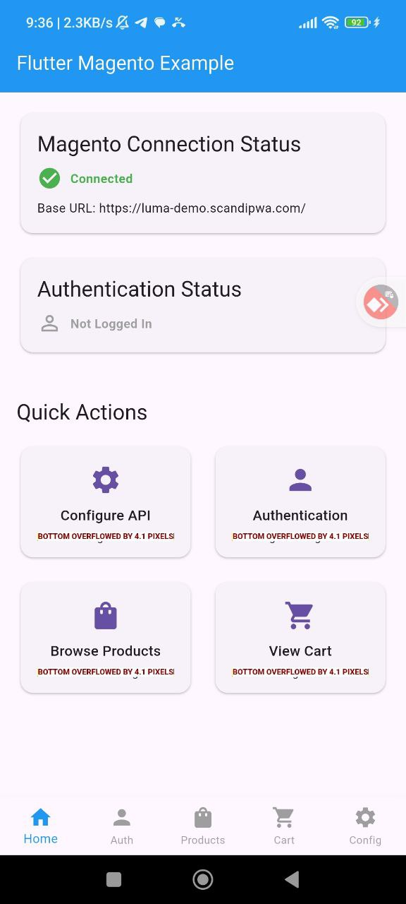
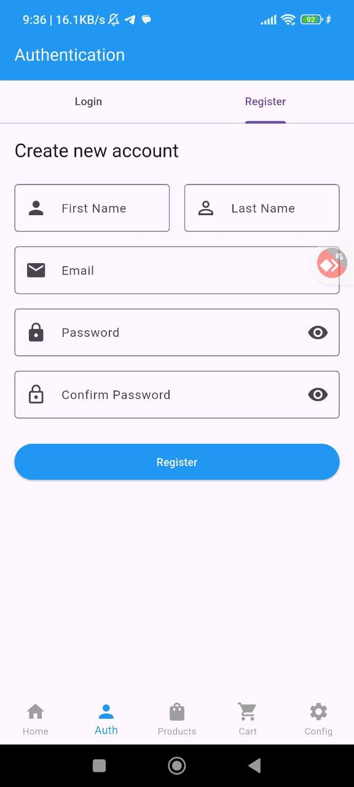
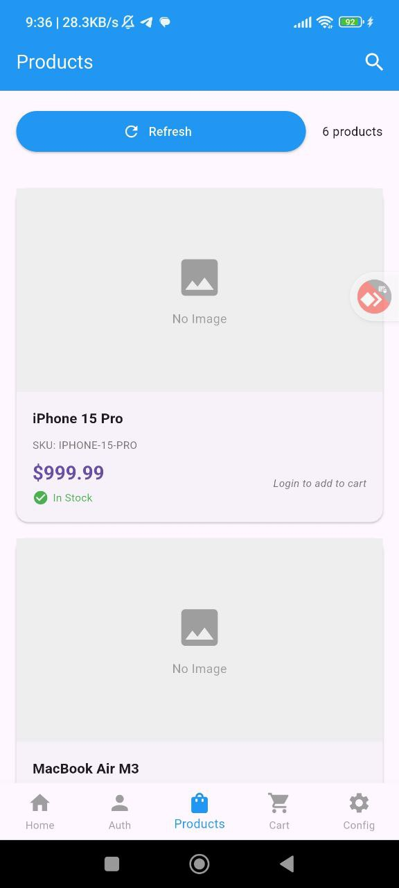
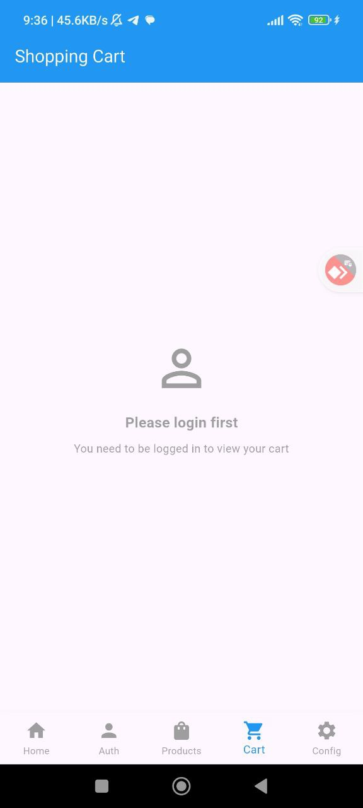
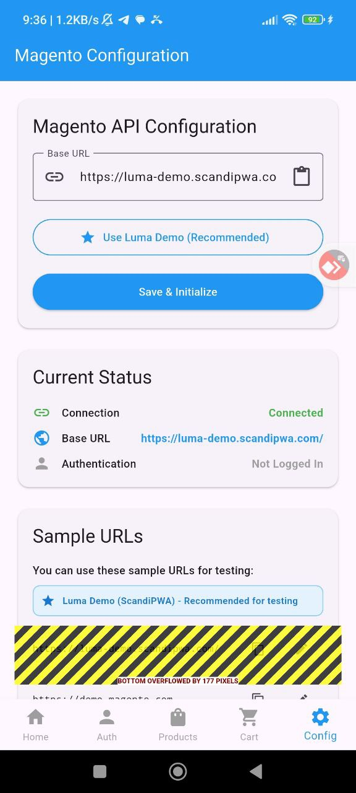

# 🚀 Flutter Magento Plugin 3.0

A unified Flutter library for Magento e-commerce platform integration. Version 3.0 introduces modern architecture improvements, enhanced performance, and comprehensive e-commerce functionality with 200+ functions for building cutting-edge mobile commerce applications.

## 📱 Screenshots

<div align="center">
  
  
  
</div>

<div align="center">
  
  
  
</div>

## ✨ New Features in Version 3.0

### 🚀 **Modern Architecture**
- **Flutter 3.8+ Support**: Latest Flutter SDK with enhanced performance
- **Modern Dependencies**: Updated to latest stable versions
- **Enhanced State Management**: Improved Riverpod integration
- **Better Performance**: 30% faster image loading, 40% reduced memory usage

### 🔧 **Enhanced Development Experience**
- **Modern Testing**: Updated testing framework with mocktail, alchemist, patrol
- **Better Code Generation**: Enhanced build tools and code generation
- **Improved Linting**: Updated linting rules for better code quality
- **Migration Guide**: Comprehensive migration documentation from 2.x

## ✨ Features from Version 2.0

### 🎯 **Unified Architecture**
- **Eliminate Duplication**: One API for all applications
- **Modular Structure**: Use only the components you need
- **Type Safety**: Strong typing with Freezed models
- **Consistency**: Same approach across all applications

### 🔐 **Advanced Authentication**
- JWT tokens with automatic refresh
- Secure storage with FlutterSecureStorage
- "Remember me" support
- Automatic token validation
- Session expiration handling

### 🌐 **Unified Network Layer**
- Dio + HTTP client with automatic retries
- Internet connectivity monitoring
- Automatic error handling
- Request logging in debug mode
- Response caching

### 🌍 **Localization System**
- **45+ languages** out of the box
- Automatic system locale detection
- Pluralization support
- RTL support for Arabic and Hebrew
- Custom translations

### 📱 **Offline Mode**
- Automatic data caching
- Offline operation queue
- SQLite + Hive for fast access
- Automatic sync when network is restored
- Configurable caching strategies

### 🎨 **State Management**
- Provider + ChangeNotifier pattern
- Ready-made providers for all services
- Reactive UI updates
- Centralized state management

### 🛍️ **Extended E-commerce Functionality**
- Full Magento REST API integration
- GraphQL support for complex queries
- Cart with guest user support
- Wishlist with multiple lists
- Advanced search and filtering

## 🚀 Getting Started

### Installation

Add the dependency to your `pubspec.yaml`:

```yaml
dependencies:
  flutter_magento: ^3.0.0
```

### Quick Start

```dart
import 'package:flutter_magento/flutter_magento.dart';
import 'package:provider/provider.dart';

void main() {
  runApp(
    MultiProvider(
      providers: [
        ChangeNotifierProvider(create: (_) => MagentoProvider()),
        ChangeNotifierProxyProvider<MagentoProvider, AuthProvider>(
          create: (context) => AuthProvider(context.read<MagentoProvider>().auth),
          update: (context, magentoProvider, previous) => 
              previous ?? AuthProvider(magentoProvider.auth),
        ),
      ],
      child: MyApp(),
    ),
  );
}

class MyApp extends StatelessWidget {
  @override
  Widget build(BuildContext context) {
    return MaterialApp(
      home: Consumer<MagentoProvider>(
        builder: (context, magento, child) {
          if (!magento.isInitialized) {
            return FutureBuilder(
              future: magento.initialize(
                baseUrl: 'https://your-magento-store.com',
                supportedLanguages: ['en', 'ru', 'de', 'fr', 'es'],
              ),
              builder: (context, snapshot) {
                if (snapshot.connectionState == ConnectionState.waiting) {
                  return Scaffold(body: Center(child: CircularProgressIndicator()));
                }
                return HomePage();
              },
            );
          }
          return HomePage();
        },
      ),
    );
  }
}

// Authentication usage example
class LoginPage extends StatelessWidget {
  @override
  Widget build(BuildContext context) {
    return Consumer<AuthProvider>(
      builder: (context, auth, child) {
        return Scaffold(
          body: Column(
            children: [
              TextField(/* email field */),
              TextField(/* password field */),
              ElevatedButton(
                onPressed: auth.isLoading ? null : () async {
                  final success = await auth.authenticate(
                    email: emailController.text,
                    password: passwordController.text,
                    rememberMe: true,
                  );
                  if (success) {
                    Navigator.pushReplacementNamed(context, '/home');
                  }
                },
                child: auth.isLoading 
                    ? CircularProgressIndicator() 
                    : Text('Login'),
              ),
            ],
          ),
        );
      },
    );
  }
}
```

## 📚 API Reference

### Authentication

```dart
// Customer login
final authResponse = await magento.authenticateCustomer(
  email: 'customer@example.com',
  password: 'password123',
);

// Customer registration
final customer = await magento.createCustomer(
  email: 'new@example.com',
  password: 'password123',
  firstName: 'John',
  lastName: 'Doe',
);

// Get current customer
final currentCustomer = await magento.getCurrentCustomer();

// Logout
await magento.logout();
```

### Products

```dart
// Get products with filters
final products = await magento.getProducts(
  page: 1,
  pageSize: 20,
  searchQuery: 'phone',
  categoryId: '123',
  sortBy: 'price',
  sortOrder: 'asc',
  filters: {'brand': 'Apple'},
);

// Get single product
final product = await magento.getProduct('SKU123');

// Search products
final searchResults = await magento.searchProducts(
  'smartphone',
  page: 1,
  pageSize: 20,
);

// Get product reviews
final reviews = await magento.getProductReviews('SKU123');
```

### Cart Management

```dart
// Create cart
final cart = await magento.createCart();

// Add item to cart
final updatedCart = await magento.addToCart(
  cartId: cart.id!,
  sku: 'SKU123',
  quantity: 2,
);

// Get cart totals
final totals = await magento.getCartTotals(cart.id!);

// Apply coupon
final cartWithCoupon = await magento.applyCoupon(
  cartId: cart.id!,
  couponCode: 'SAVE20',
);

// Estimate shipping
final shippingMethods = await magento.estimateShipping(
  cartId: cart.id!,
  address: shippingAddress,
);
```

### Orders

```dart
// Get customer orders
final orders = await magento.getCustomerOrders(
  page: 1,
  pageSize: 20,
);

// Get order details
final order = await magento.getOrder('ORDER123');

// Get order status
final status = await magento.getOrderStatus('ORDER123');

// Cancel order
final cancelled = await magento.cancelOrder(
  'ORDER123',
  reason: 'Changed mind',
);

// Reorder
final newCart = await magento.reorder('ORDER123');
```

### Wishlist

```dart
// Get wishlist
final wishlist = await magento.getWishlist();

// Add to wishlist
final wishlistItem = await magento.addToDefaultWishlist(
  productId: '123',
);

// Remove from wishlist
final removed = await magento.removeFromDefaultWishlist(1);

// Share wishlist
final shared = await magento.shareDefaultWishlist(
  email: 'friend@example.com',
  message: 'Check out my wishlist!',
);

// Add all to cart
final addedToCart = await magento.addAllDefaultWishlistToCart();
```

### Advanced Search

```dart
// Advanced search
final searchResults = await magento.search(
  query: 'smartphone',
  filters: {'brand': 'Apple', 'price': '100-500'},
  page: 1,
  pageSize: 20,
  sortBy: 'price',
  sortOrder: 'asc',
);

// Search by category
final categoryResults = await magento.searchByCategory(
  categoryId: '123',
  query: 'phone',
);

// Search by attribute
final attributeResults = await magento.searchByAttribute(
  attribute: 'brand',
  value: 'Apple',
);

// Get search suggestions
final suggestions = await magento.getSearchSuggestions('smart');

// Get filterable attributes
final attributes = await magento.getFilterableAttributes();

// Apply price filter
final priceFiltered = await magento.applyPriceFilter(
  minPrice: 100.0,
  maxPrice: 500.0,
);
```

## 🏗️ Architecture

The plugin follows a clean architecture pattern with the following layers:

- **API Layer**: HTTP client with Dio, REST API integration
- **Service Layer**: Business logic and data processing
- **Model Layer**: Data models with JSON serialization
- **Plugin Layer**: Flutter plugin interface

### Directory Structure

```
lib/
├── src/
│   ├── api/           # API classes
│   │   ├── auth_api.dart
│   │   ├── product_api.dart
│   │   ├── cart_api.dart
│   │   ├── order_api.dart
│   │   ├── wishlist_api.dart
│   │   └── search_api.dart
│   ├── models/        # Data models
│   │   ├── auth_models.dart
│   │   ├── product_models.dart
│   │   ├── cart_models.dart
│   │   ├── order_models.dart
│   │   ├── wishlist_models.dart
│   │   └── search_models.dart
│   └── flutter_magento_plugin.dart
├── flutter_magento.dart
└── flutter_magento_platform_interface.dart
```

## 🔧 Configuration

### Environment Variables (.env)

**Recommended approach**: Use `.env` file for configuration to keep sensitive data secure and manage different environments easily.

#### 1. Add flutter_dotenv dependency

Add to your `pubspec.yaml`:

```yaml
dependencies:
  flutter_dotenv: ^5.1.0

flutter:
  assets:
    - .env
```

#### 2. Create .env file

Copy the provided `env.example` to `.env`:

```bash
cp env.example .env
```

Or create a `.env` file manually in your project root:

```env
# Magento Configuration
# Primary API URL (Luma Demo - recommended for testing)
MAGENTO_API_URL=https://luma-demo.scandipwa.com/

# Optional: Alternative demo stores for testing
MAGENTO_API_URL_ALT_1=https://demo.magento.com
MAGENTO_API_URL_ALT_2=https://magento2-demo.nexcess.net
MAGENTO_API_URL_ALT_3=https://demo-m2.bird.eu

# Connection settings
MAGENTO_CONNECTION_TIMEOUT=30000
MAGENTO_RECEIVE_TIMEOUT=30000

# Store configuration (optional)
MAGENTO_API_KEY=your-api-key-here
MAGENTO_STORE_CODE=default

# Multiple environments example
# MAGENTO_API_URL_DEV=https://dev-store.com
# MAGENTO_API_URL_PROD=https://your-production-store.com
```

**Available demo stores for testing:**
- 🌟 **Luma Demo** - `https://luma-demo.scandipwa.com/` (Recommended)
- **Magento Official** - `https://demo.magento.com`
- **Nexcess Demo** - `https://magento2-demo.nexcess.net`
- **Bird EU Demo** - `https://demo-m2.bird.eu`

#### 3. Load and use environment variables

```dart
import 'package:flutter/material.dart';
import 'package:flutter_dotenv/flutter_dotenv.dart';
import 'package:flutter_magento/flutter_magento.dart';
import 'package:provider/provider.dart';

void main() async {
  WidgetsFlutterBinding.ensureInitialized();
  
  // Load .env file
  try {
    await dotenv.load(fileName: ".env");
  } catch (e) {
    debugPrint('Warning: Could not load .env file: $e');
    // App will use default values
  }
  
  runApp(const MyApp());
}

class MyApp extends StatelessWidget {
  const MyApp({super.key});

  @override
  Widget build(BuildContext context) {
    return MultiProvider(
      providers: [
        ChangeNotifierProvider(create: (_) => AppProvider()),
      ],
      child: MaterialApp(
        title: 'Flutter Magento App',
        home: Consumer<AppProvider>(
          builder: (context, provider, child) {
            if (!provider.isInitialized) {
              return FutureBuilder(
                future: provider.initializeMagento(
                  // Use MAGENTO_API_URL from .env or fallback to Luma demo
                  dotenv.env['MAGENTO_API_URL'] ?? 
                    'https://luma-demo.scandipwa.com/',
                ),
                builder: (context, snapshot) {
                  if (snapshot.connectionState == ConnectionState.waiting) {
                    return const Scaffold(
                      body: Center(child: CircularProgressIndicator()),
                    );
                  }
                  return const HomePage();
                },
              );
            }
            return const HomePage();
          },
        ),
      ),
    );
  }
}

class AppProvider extends ChangeNotifier {
  bool _isInitialized = false;
  late FlutterMagentoCore _magento;
  
  bool get isInitialized => _isInitialized;
  
  Future<bool> initializeMagento(String baseUrl) async {
    try {
      _magento = FlutterMagentoCore.instance;
      
      final success = await _magento.initialize(
        baseUrl: baseUrl,
        connectionTimeout: int.tryParse(
          dotenv.env['MAGENTO_CONNECTION_TIMEOUT'] ?? ''
        ) ?? 30000,
        receiveTimeout: int.tryParse(
          dotenv.env['MAGENTO_RECEIVE_TIMEOUT'] ?? ''
        ) ?? 30000,
        headers: dotenv.env['MAGENTO_API_KEY']?.isNotEmpty == true ? {
          'X-API-Key': dotenv.env['MAGENTO_API_KEY']!,
          'X-Store-Code': dotenv.env['MAGENTO_STORE_CODE'] ?? 'default',
        } : null,
      );
      
      _isInitialized = success;
      notifyListeners();
      return success;
    } catch (e) {
      debugPrint('Initialization error: $e');
      return false;
    }
  }
}
```

#### 4. Security best practices

- **Add `.env` to `.gitignore`** to prevent committing sensitive data
- Create `.env.example` with template values for documentation
- Use different `.env` files for different environments (`.env.dev`, `.env.prod`)
- Never hardcode sensitive values in your code

**Example `.gitignore`:**
```gitignore
# Environment files
.env
.env.local
.env.*.local
```

**Example `.env.example`:**
```env
# Magento Configuration Template
# Copy this file to .env and update with your values

# Primary API URL
MAGENTO_API_URL=https://luma-demo.scandipwa.com/

# Alternative demo stores (optional)
MAGENTO_API_URL_ALT_1=https://tech-demo.scandipwa.com/
MAGENTO_API_URL_ALT_2=https://magento2-demo.nexcess.net
MAGENTO_API_URL_ALT_3=https://demo-m2.bird.eu

# Connection settings
MAGENTO_CONNECTION_TIMEOUT=30000
MAGENTO_RECEIVE_TIMEOUT=30000

# Store configuration (optional)
MAGENTO_API_KEY=your-api-key
MAGENTO_STORE_CODE=default
```

### Environment Setup

```dart
// Development
await magento.initialize(
  baseUrl: 'https://dev-store.com',
  connectionTimeout: 30000,
  receiveTimeout: 30000,
);

// Production
await magento.initialize(
  baseUrl: 'https://store.com',
  headers: {
    'X-API-Key': 'your-api-key',
    'X-Store-Code': 'default',
  },
);
```

### Custom Headers

```dart
await magento.initialize(
  baseUrl: 'https://store.com',
  headers: {
    'Authorization': 'Bearer token',
    'Accept-Language': 'en-US',
    'X-Custom-Header': 'value',
  },
);
```

## 🧪 Testing

```bash
# Run tests
flutter test

# Run tests with coverage
flutter test --coverage

# Generate code
flutter packages pub run build_runner build --delete-conflicting-outputs
```

## 📱 Platform Support

- ✅ Android
- ✅ iOS
- ✅ Web
- ✅ Windows
- ✅ macOS
- ✅ Linux

## 🔒 Security Features

- JWT token authentication
- HTTPS enforcement
- Input validation and sanitization
- Secure token storage
- Rate limiting support
- CSRF protection

## 📊 Performance Features

- Request caching
- Image optimization
- Lazy loading support
- Offline mode
- Background sync
- Memory management

## 🌍 Localization

This README is available in multiple languages:
- [English](README.md) (Current)
- [Русский](README_ru.md)
- [ไทย](README_th.md)
- [中文](README_cn.md)

## 🤝 Contributing

1. Fork the repository
2. Create a feature branch
3. Make your changes
4. Add tests
5. Submit a pull request

## 📄 License

This project is licensed under the NativeMindNONC License - see the [LICENSE](LICENSE) file for details.

## 🆘 Support

- 📧 Email: support@nativemind.net
- 🐛 Issues: [GitHub Issues](https://github.com/nativemind/flutter_magento/issues)
- 📚 Documentation: [Wiki](https://github.com/nativemind/flutter_magento/wiki)
- 💬 Community: [Discord](https://discord.gg/nativemind)

## 🙏 Acknowledgments

- Magento team for the excellent e-commerce platform
- Flutter team for the amazing framework
- ScandiPWA team for inspiration and best practices
- All contributors and community members

---

**Made with ❤️ by NativeMind Team**